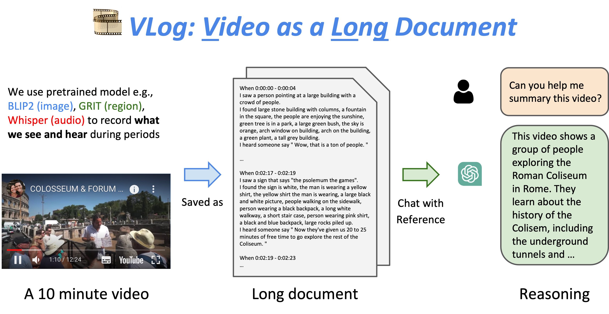

# 🎞 VLog: Video as a Long Document



### **News**

- 20/April/2023: We release our project on github and Huggingface!

### To Do List

**Done**

- [ ] Huggingface Space
- [x] LLM Reasoner: ChatGPT (multilingual) + LangChain
- [x] Vision Captioner: BLIP2 + GRIT
- [x] ASR Translator: Whisper (multilingual)
- [x] Video Segmenter: KTS

**Doing** 

> there are a lot of improvement space we are working on it

- [ ] Improve Vision Models: MiniGPT-4, LLaVA, Family of Segment-anything
- [ ] Replace ChatGPT with own trained LLM
- [ ] Improve ASR Translator

## 🧸 Examples

## 🔨 Preparation

Please find installation instructions in [install.md](https://github.com/showlab/Image2Paragraph/blob/main/install.md).

## 🌟 Start here

### Run in cmd

```
python main.py --video_path "examples/demo.mp4"
```

The generated vlog is saved in `examples/demo.log`

### Run in Gradio

```
python main_gradio.py
```

## 🙋 Suggestion

The project is stay tuned 🔥

If you have more suggestions or functions need to be implemented in this codebase, feel free to drop us an email `kevin.qh.lin@gmail`, `leiwx52@gmail.com` or open an issue.

## 😊 Acknowledgment

This work is based on [ChatGPT](http://chat.openai.com), [BLIP2](https://huggingface.co/spaces/Salesforce/BLIP2), [GRIT](https://github.com/JialianW/GRiT), [KTS](https://inria.hal.science/hal-01022967/PDF/video_summarization.pdf), [Whisper](https://github.com/openai/whisper), [LangChain](https://python.langchain.com/en/latest/), [Image2Paragraph](https://github.com/showlab/Image2Paragraph).

See other wonderful Video + LLM projects: [Ask-anything](https://github.com/OpenGVLab/Ask-Anything), [Socratic Models](https://socraticmodels.github.io/), [Vid2Seq](https://ai.googleblog.com/2023/03/vid2seq-pretrained-visual-language.html), [LaViLa](https://github.com/facebookresearch/LaViLa).
