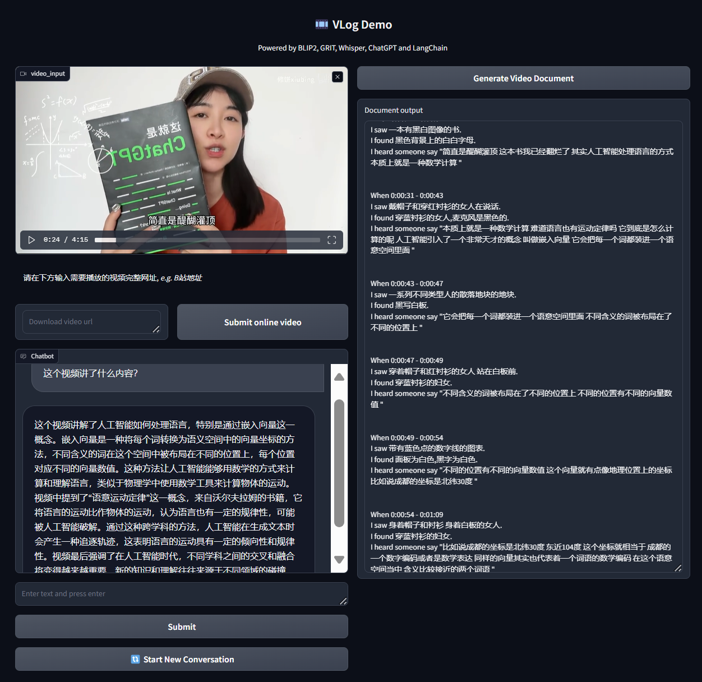
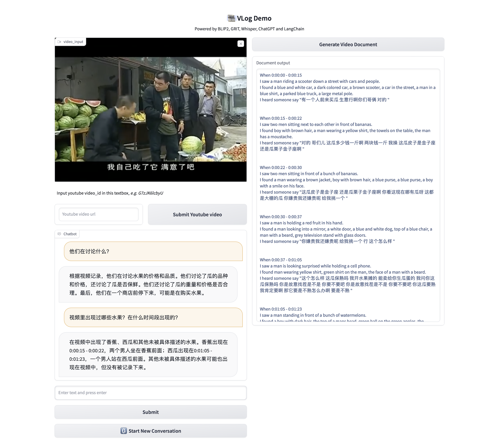

# 🎞 使用多模态大模型进行视频辅助分析(Analyze Videos via multimodal features and LLMs)

Given a long video, we turn it into a doc containing visual + audio info. By sending this doc to custom LLMs, we can chat over the video! 


### **News**

- 2024年8月17日: 我们在开源项目[VLog](https://github.com/showlab/VLog)的基础上开发了可以与任意本地或者online LLMs API (together.ai or Doubao API)进行交互的多模态视频分析程序!


### To Do List

**Done**

- [x] Using Custom LLMs
- [x] Implement Chinese QA and Caption annotation

**Doing** 

- [ ] Improve QA quality


## 🧸 Examples
<details><summary>[ Vlog - 语言也有运动规律 ]</summary>
</details>

<details open><summary>[ News - 奥运潘展乐谈不要框住自己  ]</summary>
</details>

## 🔨 Preparation

Please find installation instructions in [install.md](install.md).

## 🌟 Start here

### Run in cmd

```
python main.py --video_path examples/buy_watermelon.mp4 
```

The generated video document will be generated and saved in `examples/buy_watermelon.log`

### Run in Gradio

```
python main_gradio.py
```

## 🙋 Suggestion

Stay tuned for our project 🔥

If you have more suggestions or functions need to be implemented in this codebase, feel free to drop an Email to me or original authors or open an issue.

## 😊 Acknowledgment

This work is based on [ChatGPT](http://chat.openai.com), [BLIP2](https://huggingface.co/spaces/Salesforce/BLIP2), [GRIT](https://github.com/JialianW/GRiT), [KTS](https://inria.hal.science/hal-01022967/PDF/video_summarization.pdf), [Whisper](https://github.com/openai/whisper), [LangChain](https://python.langchain.com/en/latest/), [Image2Paragraph](https://github.com/showlab/Image2Paragraph).
