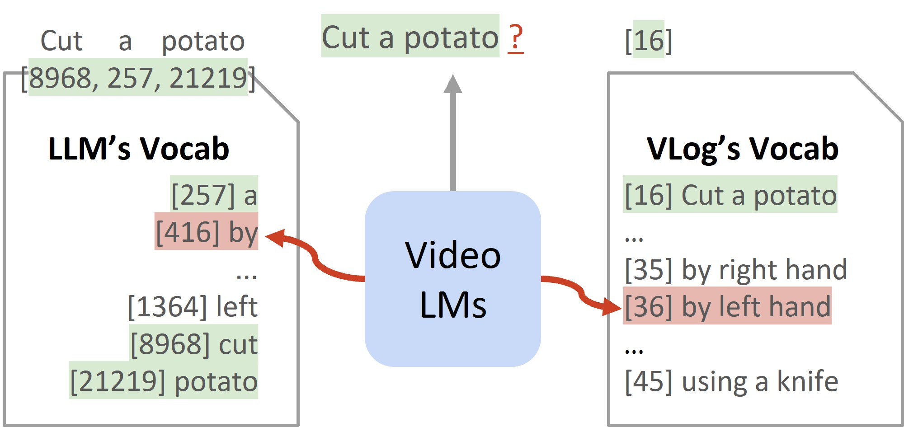

# VLog
> **VLog: Video-Language Models by Generative Retrieval of Narration Vocabulary** 
> [Kevin Qinghong Lin](https://qinghonglin.github.io/), [Mike Zheng Shou](https://scholar.google.com/citations?user=h1-3lSoAAAAJ&hl=en)
>  Show Lab @ National University of Singapore 

|      | [VLog (CVPR'25)](./VLog)   |[VLog-Agent](./VLog-agent/)|
|-----------|-----------|-----------|
|**TL;DR**| Video Narration as Vocabulary|Video as Long Document|
||  |  |
|**Introduction**|A novel, efficient video narrator (GPT2-based) with Narration Vocabulary via Generative Retrieval.|Given a video, we turn it into a textual document containing visual + audio info.|