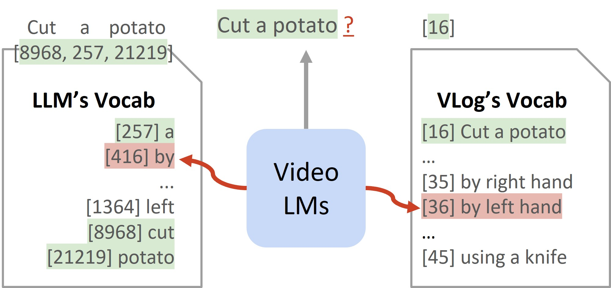

# VLog: Video Narration as Vocabulary
> **VLog: Video-Language Models by Generative Retrieval of Narration Vocabulary**<br>
> [Kevin Qinghong Lin](https://qinghonglin.github.io/), [Mike Zheng Shou](https://scholar.google.com/citations?user=h1-3lSoAAAAJ&hl=en)
> <br>Show Lab @ National University of Singapore<br>

**TL;DR:** A novel, efficient video narrator (GPT2-based) with Narration Vocabulary via Generative Retrieval.

- **Video Narration as Vocabulary**



- **Generative Retrieval**


## 🔨 Preparation
Please see [INSTALL.md](INSTALL.md)

## 🚀 Training
Please see [TRAIN.md](TRAIN.md).

Stay tune for more updates!

## ⭐ Run on your own video
Download VLog model and vocabulary [here](https://huggingface.co/KevinQHLin/VLog/tree/main).
```bash
mkdir pretrained
huggingface-cli download KevinQHLin/VLog --repo-type model --local-dir ./pretrained/
```

Then, refer to `demo.py` by providing your own video. Have fun!

## 😊 Acknowledgment
This codebase is built upon of [Fromage](https://github.com/kohjingyu/fromage).

We extend our gratitude to [LLoVi](https://github.com/CeeZh/LLoVi) for organizing EgoSchema annotations and [MVU](https://github.com/kahnchana/mvu) for the likelihood selection implementation. 

## 🎓 BibTeX
If you find our work helpful, please kindly consider citing our paper.

```
@misc{lin2025vlogvideolanguagemodelsgenerative,
      title={VLog: Video-Language Models by Generative Retrieval of Narration Vocabulary}, 
      author={Kevin Qinghong Lin and Mike Zheng Shou},
      year={2025},
      eprint={2503.09402},
      archivePrefix={arXiv},
      primaryClass={cs.CV},
      url={https://arxiv.org/abs/2503.09402}, 
}
```