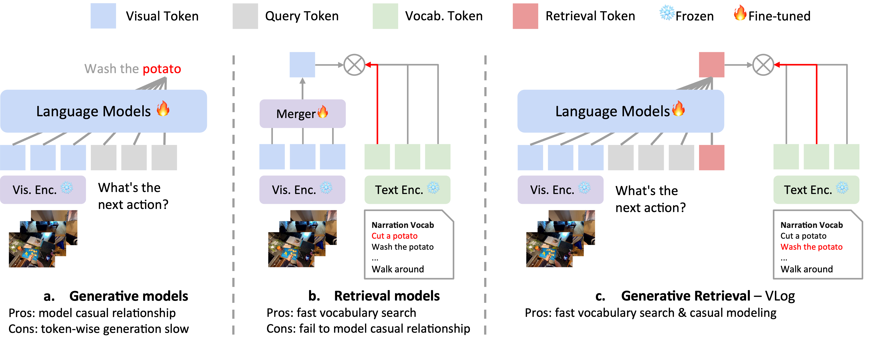

# VLog: Video Narration as Vocabulary
A novel, efficient video narrator (GPT2-based) with Narration Vocabulary via Generative Retrieval.

- **Video Narration as Vocabulary**


- **Generative Retrieval**



## 🔨 Preparation
Please see [INSTALL.md](INSTALL.md)

## 🚀 Training
Please see [TRAIN.md](TRAIN.md).

Stay tune for more updates!

## ⭐ Run on your own video
Download VLog model and vocabulary [here](https://huggingface.co/KevinQHLin/VLog/tree/main).
```bash
mkdir pretrained
huggingface-cli download KevinQHLin/VLog --repo-type model --local-dir ./pretrained/
```

Then, refer to `demo.py` by providing your own video. Have fun!

## 😊 Acknowledgment
This codebase is built upon of [Fromage](https://github.com/kohjingyu/fromage).